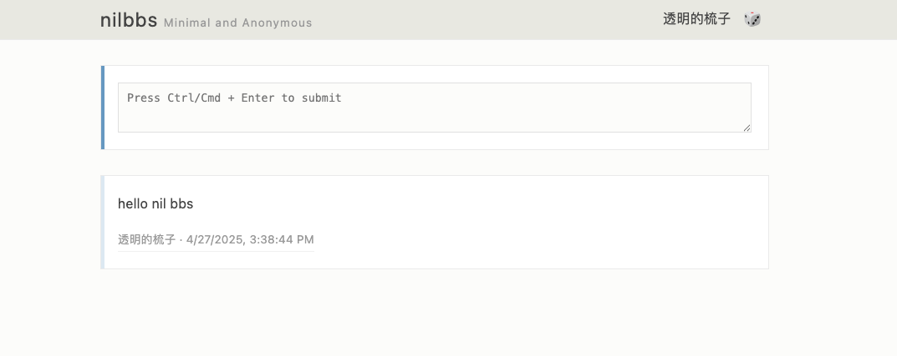
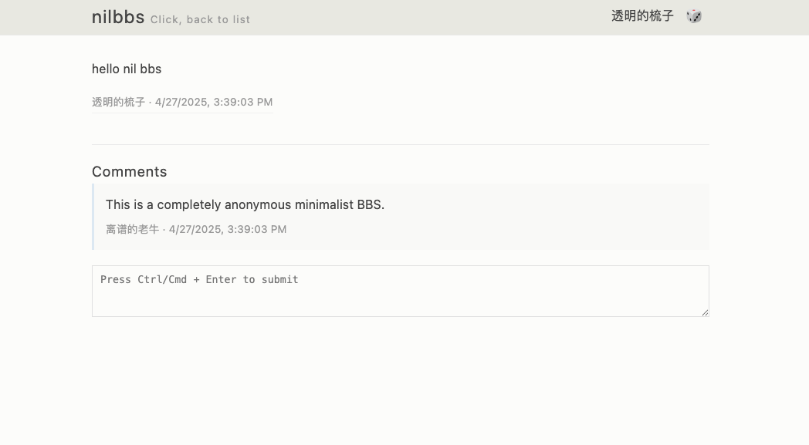

# nilbbs

NilBBS is a minimalist anonymous bulletin board system (BBS) that supports posting and replying functionality.

[English](README.md) | [中文](README_zh.md)




## Features

- [x] Minimalist design
- [x] Anonymous posting
- [x] Replying to posts
- [x] Simple and clean user interface
- [x] Periodic deletion of old posts

## Quick Start

### Running with Executable

1.  **Download**: Download the latest release for your platform from [GitHub Releases](https://github.com/Mammoth777/nilbbs/releases).
2.  **Extract**: Extract the archive (if applicable).
3.  **Run**:
    *   Open a terminal and navigate to the extracted directory.
    *   Run the executable:

    ```bash
    # On macOS/Linux
    chmod +x ./nilbbs
    ./nilbbs

    # On Windows
    nilbbs.exe
    ```

The server will start at http://localhost:8080.

You can configure the application using environment variables, such as setting the port or the automatic post deletion time. See the [Configuration](#configuration) section for details.

### Docker

You can also run nilbbs using Docker:

```bash
# Pull the latest image
docker pull mammoth777/nilbbs:latest

# Run the container
docker run -d -p 8080:8080 mammoth777/nilbbs:latest

# With custom configuration
docker run -d -p 3000:3000 -e NILBBS_PORT=3000 -e NILBBS_INACTIVE_DAYS_BEFORE_DELETE=14 mammoth777/nilbbs:latest
```

Or use docker-compose:

```yaml
# docker-compose.yml
version: '3'
services:
  nilbbs:
    image: mammoth777/nilbbs:latest
    ports:
      - "8080:8080"
    environment:
      - NILBBS_INACTIVE_DAYS_BEFORE_DELETE=7
    restart: unless-stopped
```

Then run:

```bash
docker-compose up -d
```

## Configuration

Configuration is handled through environment variables:

- `NILBBS_INACTIVE_DAYS_BEFORE_DELETE`: Number of days before inactive posts are deleted (default: 7)
- `NILBBS_PORT`: Server port to listen on (default: 8080)

Example:

```bash
# Set posts to be deleted after 14 days of inactivity
NILBBS_INACTIVE_DAYS_BEFORE_DELETE=14 ./nilbbs

# Start server on port 3000
NILBBS_PORT=3000 ./nilbbs

# Combine multiple settings
NILBBS_PORT=3000 NILBBS_INACTIVE_DAYS_BEFORE_DELETE=14 ./nilbbs
```

## For Developers

### Prerequisites

- Go 1.19 or higher
- Git

### Development Setup

1. Clone the repository:

```bash
git clone https://github.com/Mammoth777/nilbbs.git
cd nilbbs
```

2. Run the application:

```bash
go run main.go
```

Or build and run:

```bash
go build
./nilbbs
```

### Using Makefile

The project includes a Makefile for common operations:

```bash
# Build the application
make build

# Build with reduced binary size
make build-small

# Build for production (CGO disabled)
make build-prod

# Build for specific platforms
make build-windows
make build-linux
make build-macos
make build-arm64

# Build for all platforms
make build-all
```

## API Endpoints

- `GET /api/posts`: Get all posts
- `GET /api/posts/:id`: Get a specific post with its comments
- `POST /api/posts`: Create a new post
- `POST /api/posts/:id/comments`: Add a comment to a post

## License

[MIT License](LICENSE)